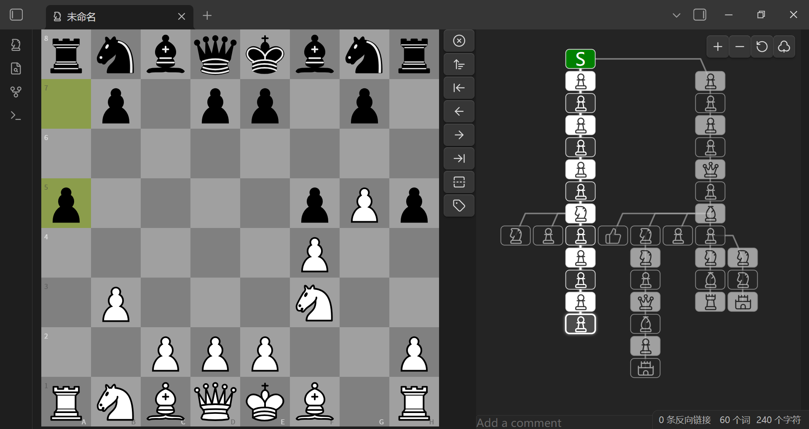
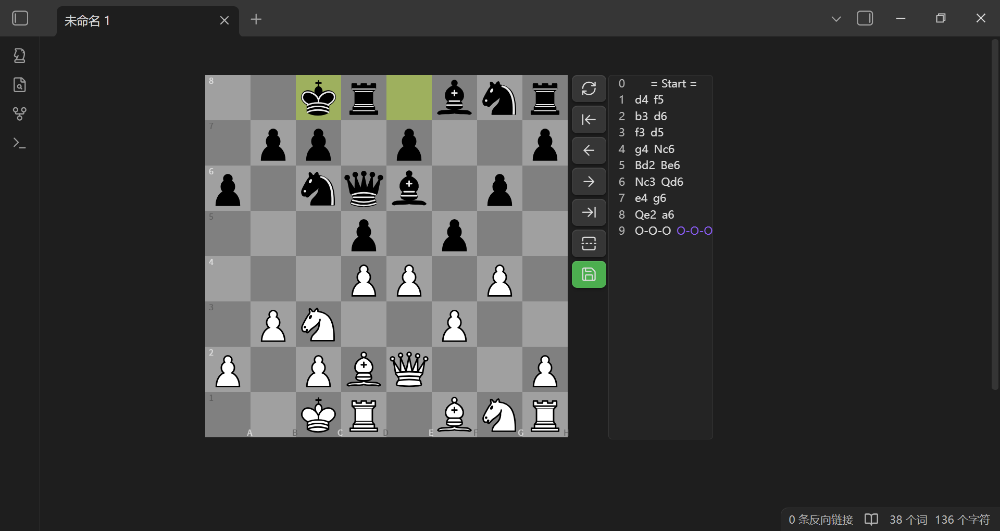
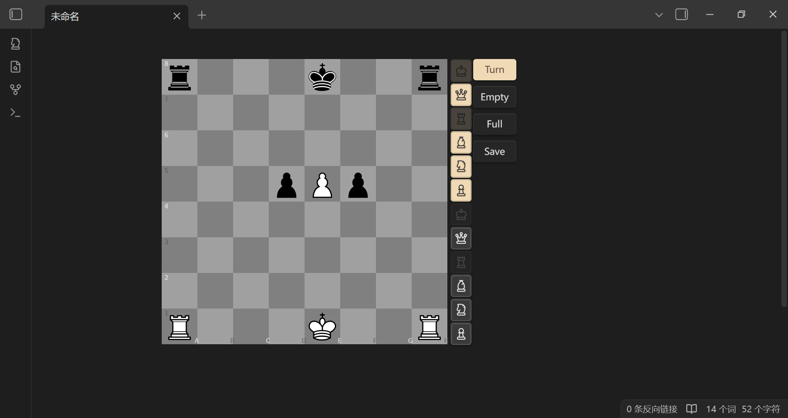

# Obsidian 国际象棋插件


[](./LICENSE)

[中文](./README.md) | [English](./README.en.md)

如果你喜欢这个项目，欢迎到我的主页  
[](https://space.bilibili.com/156446344)  
点赞、投币、交流 

## 插件简介

**Obsidian 国际象棋插件** 是一款为 Obsidian 笔记软件量身打造的国际象棋渲染引擎，支持以 FEN 和 PGN 格式展示棋局、推演走棋、管理分支变着。基于 [chess.js](https://github.com/jhlywa/chess.js) 提供完整的棋规支持。

## PGN 文件支持

本插件注册了 `.pgn` 文件的专属视图，在 Obsidian 中直接打开 `.pgn` 文件即可查看可交互的棋盘界面。

- **实时读写**：对棋谱的任何操作（走子、添加变招、评论、标注）都会自动保存回原始文件
- **分支变着**：支持 Tree 图展示变着分支，可点击节点跳转
- **评论与标注**：支持 `!` `?` `W+` `B+` `=` 等标注符号
- **切换视图**：支持通过文件菜单在文本视图和 PGN 视图间切换
- **快速新建**：工具栏按钮一键新建 PGN 文件

> **注意**：`.pgn` 文件仅支持单局棋谱。多局 PGN 文件建议借助 AI 添加代码块标记转换成 Markdown 格式：
> ````markdown
> ```chess
> [Event "第一局"]
> 1. e4 e5 2. Nf3 Nc6 1-0
> ```
> ```chess
> [Event "第二局"]
> 1. d4 d5 2. c4 e6 1/2-1/2
> ```
> ````



## 代码块

提供两种代码块：

---

`chess`：在 Markdown 文件中展示并推演棋局

````markdown
```chess
1. e4 e5
2. Nf3 Nc6
3. Bb5 a6
```
````



---

`fen`：可视化编辑棋盘，保存生成带 FEN 的 `chess` 代码块

````markdown
```fen

```
````



---

## 功能特点

- **完整棋规**：基于 chess.js，支持王车易位、吃过路兵、升变、将军/将杀检测、三次重复和棋、50步规则
- **棋盘渲染**：基于 chessground 的高品质棋盘，支持拖拽走棋
- **着法列表**：显示完整走棋记录，点击跳转至任意一步
- **分支变着**：Tree 图展示变着树，支持节点图标/SAN 两种显示模式
- **可视化编辑**：FEN 编辑器支持拖拽/点击摆放棋子，清空/填满辅助，切换先手
- **棋谱保存**：
  - 无着法时保存按钮为**灰色**，有着法时为**绿色**，修改后为**橙色**
  - 点击保存时弹出确认提示
- **自定义设置**：
  - 棋盘主题：木质、绿绒布、蓝色、灰色、深色、浅色
  - 工具栏位置（右侧 / 底部）
  - 棋盘大小、着法文字大小
  - 着法列表显示方式
  - 自动跳转到结尾
  - 可选朗读着法（移动端不支持）
- **棋局标记**：支持在棋盘上绘制箭头和高亮标记
- **移动端适配**：通过调整棋盘大小可适配手机等小屏设备

## 使用方法

### `fen` 代码块

1. 输入 `fen` 代码块标记即可进入编辑器
2. 拖拽或点击棋子按钮摆放，清空/填满棋盘，切换先手
3. 编辑好后点击保存，会生成带 FEN 的 `chess` 代码块

### `chess` 代码块

1. 将棋谱写入 `chess` 代码块中（可含 FEN 和 SAN 着法）
2. FEN 可省略，默认从标准开局开始
3. 操作说明：
   - 未手动走棋时，着法列表展示 PGN 内容
   - 手动走棋后，着法列表展示修改后的记录
   - 点击「重置」恢复到手动推演前的着法
4. 点击「保存」将当前走法覆盖原 PGN 内容

### 可选参数

| 名称            | 值         | 描述                            |
| --------------- | ---------- | ------------------------------- |
| `protected`/`p` | true/false | true 时保存按钮失效，默认 false |
| `rotated`/`r`   | true/false | true 时倒转棋盘（黑方在下）     |

#### 示例

````markdown
```chess
r:true
p:true
[FEN "rnbqkbnr/pppppppp/8/8/4P3/8/PPPP1PPP/RNBQKBNR b KQkq - 0 1"]
1... e5 2. Nf3 Nc6
```
````

- 冒号中英文皆可，`r` `p` 大小写皆可
- FEN 两边带不带引号都行
·
## 安装说明

> ~~本插件已在 Obsidian 官方插件市场上线，搜索 "Chess" 即可安装。~~（尚未上架，待发布）

1. 打开 Obsidian
2. 进入 **设置** (Settings)
3. 点击 **第三方插件** (Community plugins)
4. 确保 **安全模式** (Restricted mode) 已关闭
5. 点击 **浏览** (Browse)
6. 搜索 "Chess"
7. 找到本插件并点击 **安装** (Install)
8. 安装完成后点击 **启用** (Enable)

## 构建

```bash
git clone https://github.com/west-shell/obsidian-chess-tree.git
cd obsidian-chess-tree
npm install
npm run build        # 开发版本（不压缩，带 sourcemap）
npm run build:min    # 精简版本（压缩，适合发布）
```

## 打赏

如果喜欢该插件，可以打赏一下哦

