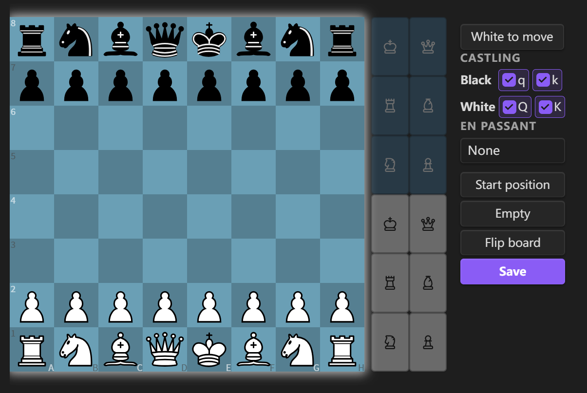

# Chess Tree


[](./LICENSE)
[](https://paypal.com/paypalme/weshell1988)

[中文](./README.zh.md) | [English](./README.md)

If you like this project, feel free to check out my page on  
[](https://space.bilibili.com/156446344)  
Likes, coins, and feedback are greatly appreciated.

## Overview

Obsidian plugin for chess rendering and exploration inside notes. Supports PGN file viewing, two code block types (`fen`, `tree`), full chess rules via [chess.js](https://github.com/jhlywa/chess.js), interactive board via [chessground](https://github.com/lichess-org/chessground), variation tree visualization, and built-in engine analysis powered by [Stockfish 18](https://stockfishchess.org/) (WASM).

## PGN File Support

Open `.pgn` files directly in Obsidian — the plugin registers a dedicated `.pgn` file view with an interactive board interface.

- **Manual Save**: Any changes (moves, variations, comments, annotations) are saved back to the file when clicking Save button
- **Variation Tree**: Interactive tree graph showing all branches — click nodes to navigate
- **Comments & Annotations**: Supports branch diagram and board annotation symbols, comments
- **Mode Toggle**: Switch between icon mode and text mode in branch diagram
- **Quick Create**: New PGN files from the ribbon button
- **Custom File Types**: Set specific file types as PGN files
- **Context Menu**: Right-click PGN files to switch between PGN view and Markdown view

> **Note**: `.pgn` files only support single games. For multi-game PGN files, use AI to add code block markers and convert to Markdown format:
>
> ````markdown
> ```chess
> [Event "Game 1"]
> 1. e4 e5 2. Nf3 Nc6 1-0
> ```
>
> ```chess
> [Event "Game 2"]
> 1. d4 d5 2. c4 e6 1/2-1/2
> ```
> ````


## Code Blocks

Two code block types — all code block names are customizable.

---

`chess`: Display and explore chess games with variation tree

````markdown
```chess
1. e4 e5
2. Nf3 Nc6
3. Bb5 a6
```
````


---

`fen`: Visual board editor — set up a position and save as a `chess` code block

````markdown
```fen

```
````



---

## Mobile Usage

For the best experience on mobile devices, it's recommended to install the Full Screen Toggle plugin ([donkeypacific/obsidian-full-screen-cross-platform-plugin](https://github.com/donkeypacific/obsidian-full-screen-cross-platform-plugin)) or similar fullscreen plugins and adjust the top/bottom margins in **Settings > Chess > Board Margins** to optimize the board display area.


## Settings

### Board Appearance

- **Theme**: Wood, Green, Blue, Grey, Dark, Light
- **Cell Size**: Adjustable board cell size (15–100 px)
- **Layout**: Toolbar position — right / bottom
- **Coordinate Labels**: Show/hide board coordinates

### Game Hints

- **Last Move Highlight**: Highlight the last move on the board
- **Legal Moves**: Show legal move destinations
- **Turn Border**: Highlight the current player's turn
- **Move Narration**: Optional speech synthesis for moves (desktop only)

### Move List

- **Show Move List**: Toggle move list visibility
- **Show Move Text**: Toggle text notation in move list
- **Font Size**: Adjustable move text size (10–25 px)
- **Auto Jump**: Jump to latest position — never / always / auto

### Board Margins

- **Top Margin**: Adjustable top margin (0–100 px)
- **Bottom Margin**: Adjustable bottom margin (0–100 px)

### Code Block Names

Customize code block aliases in **Settings > Chess > Code Block Names**:

- **Code block names**: Default `chess, tree` — both names render the tree view with variation tree and engine analysis. Add custom aliases separated by commas
- **FEN save as**: Choose which code block name to use when saving from the FEN editor (default `tree`)

> **Note**: Changes require restarting the plugin or Obsidian to take effect.

### Engine Analysis

- **Engine Depth**: Search depth for Stockfish analysis (1–30, default 18)
- **Engine Skill Level**: Skill level for engine play (0–20, default 20)
- **Save Eval by Default**: Automatically include eval data when saving (default off)
- **Save Eval Prompt**: Show prompt when saving with eval data (default on)

### Save

- **Save Eval by Default**: Whether to include eval annotations when saving PGN (default off)
- **Save Eval Prompt**: Whether to show a prompt about eval when saving (default on)

### PGN File View

Enable/disable PGN file view and customize file extensions:

- **Enable PGN file view**: Toggle to register/unregister PGN view
- **PGN file extensions**: Default `pgn`, add custom extensions separated by commas

> **Note**: Changes require restarting the plugin or Obsidian to take effect.

## Features

- **Complete Rules Engine**: Castling, en passant, promotion, check/checkmate detection, threefold repetition, 50-move rule — all via chess.js
- **Board Rendering**: High-quality chessboard via chessground with drag-and-drop moves
- **Move List**: Full move record with click-to-navigate
- **Variation Tree**: Tree graph with icon/SAN display modes for node labels
- **Visual FEN Editor**: Drag/click to place pieces, clear/fill board, toggle side to move, set castling and en passant
- **PGN Saving**:
  - Button colors — **gray** (empty), **green** (saved), **orange** (modified)
  - Confirmation dialog before saving
- **i18n**: Supports English and Chinese UI
- **Board Markers**: Draw arrows and highlights on the board
- **Engine Analysis**: Built-in Stockfish 18 WASM engine with single position analysis, batch analysis, and auto-analysis
  - **Best Move Arrow**: Green arrow shows the engine's best move; yellow arrow shows the ponder move
  - **Eval Bar**: Left sidebar bar showing evaluation (green = white advantage, red = black advantage)
  - **Eval Trend Chart**: Vertical polyline in the slider background showing evaluation across moves
  - **Eval Color Bar**: Color bar on tree nodes indicating evaluation (green = white advantage, red = black advantage, gray = equal)
  - **Eval Persistence**: Engine evaluations saved as `%e:` comments in PGN
- **Mobile Friendly**: Adjust board size for small screens

## Usage

### `fen` Code Block

1. Add a `fen` code block to start the editor
2. Drag pieces or click piece buttons to set up the position
3. Set turn, castling rights, and en passant as needed
4. Click Save — the `fen` code block is replaced with a `chess` code block containing the FEN, ready for play

### `chess` Code Block

1. Write your game inside a `chess` code block (optionally with FEN and SAN moves)
2. FEN is optional — defaults to the standard starting position
3. Controls:
   - The variation tree displays all branches graphically
   - Click any node to navigate to that position
4. Click **Save** to overwrite the original PGN
5. Click **Edit board** in the Edit menu to switch to position editor mode
   - Modify the position by dragging/clicking pieces
   - Set turn, castling rights, and en passant
   - Click Save to apply the new position (existing moves will be discarded)
   - Click Cancel to return to tree view
6. Use engine analysis:
   - Click **Analyze** for single position analysis, **Batch** to analyze all nodes, or enable auto-analysis
   - Green arrow = best move, yellow arrow = ponder move
   - Eval bar on the left shows position evaluation
   - Eval color bars on nodes and eval trend chart on the slider show evaluation across the game

### Optional Parameters

| Name              | Value        | Description                                       |
| ----------------- | ------------ | ------------------------------------------------- |
| `protected` / `p` | true / false | When true, Save button is disabled; default false |
| `rotated` / `r`   | true / false | When true, board is flipped (Black on bottom)     |

#### Example

````markdown
```chess
r:true
p:true
[FEN "rnbqkbnr/pppppppp/8/8/4P3/8/PPPP1PPP/RNBQKBNR b KQkq - 0 1"]
1... e5 2. Nf3 Nc6
```
````

- Colons can be Chinese or English; `r` and `p` are case-insensitive
- FEN value works with or without quotes

## Installation

1. Open Obsidian
2. Go to **Settings**
3. Click **Community plugins**
4. Ensure **Restricted mode** is off
5. Click **Browse**
6. Search for "Chess"
7. Find this plugin and click **Install**
8. Click **Enable**

## Build

```bash
git clone https://github.com/west-shell/obsidian-chess-tree.git
cd obsidian-chess-tree
npm install
npm run build        # Dev build (unminified, with sourcemaps)
npm run build:min    # Minified build (for release)
```

## Donation

If you like this plugin, feel free to support me!

[](https://paypal.com/paypalme/weshell1988)


