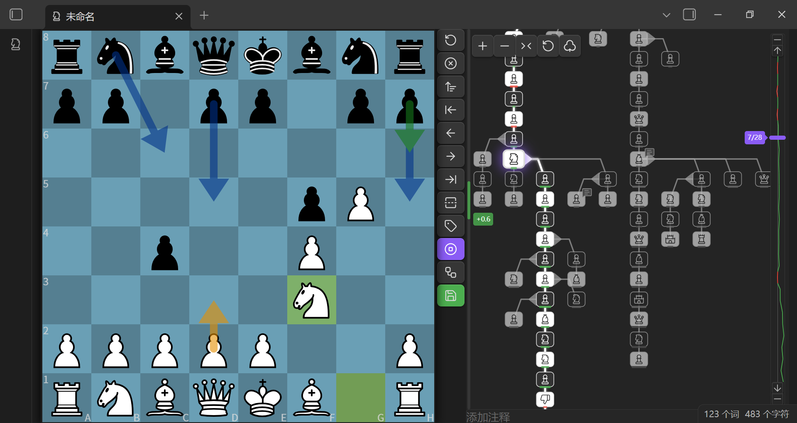
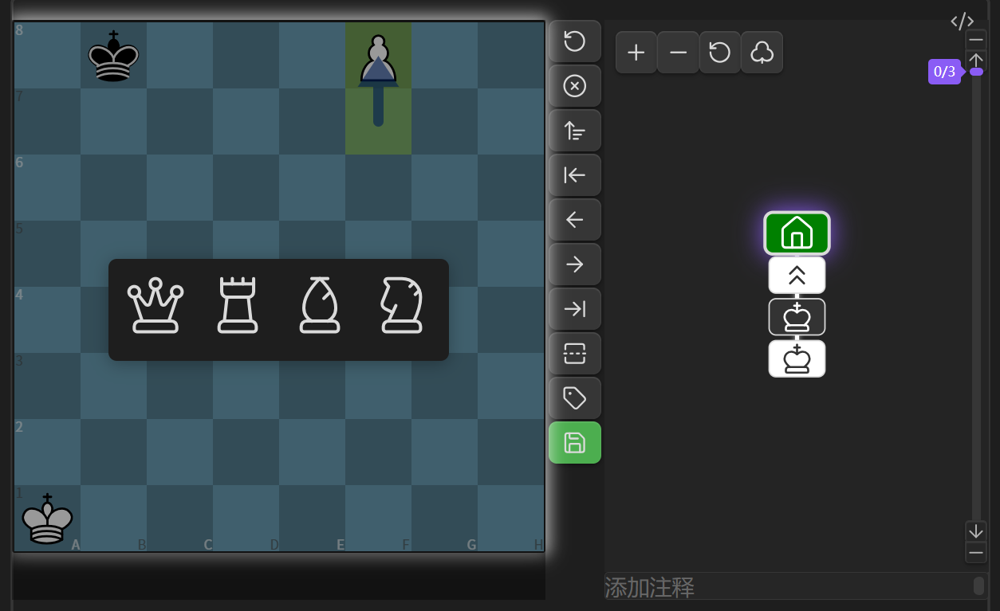
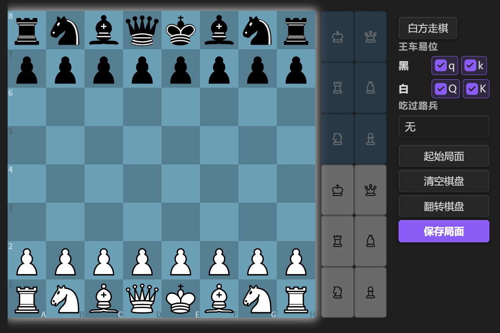
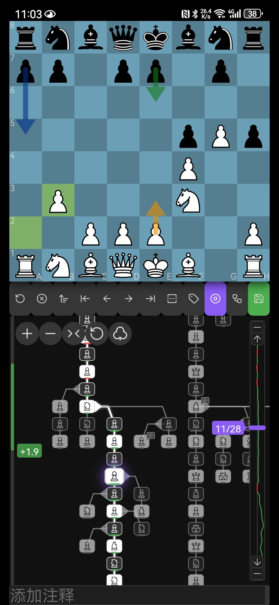

# Obsidian 国际象棋插件


[](./LICENSE)
[](https://paypal.com/paypalme/weshell1988)

[中文](./README.zh.md) | [English](./README.md)

如果你喜欢这个项目，欢迎到我的主页  
[](https://space.bilibili.com/156446344)  
点赞、投币、交流

## 插件简介

Obsidian 国际象棋插件，提供笔记内棋局渲染与探索功能。支持 PGN 文件查看、两种代码块类型（`fen`、`tree`）、基于 [chess.js](https://github.com/jhlywa/chess.js) 的完整棋规、通过 [chessground](https://github.com/lichess-org/chessground) 实现的交互式棋盘，变着分支树可视化，以及内置 [Stockfish 18](https://stockfishchess.org/) (WASM) 引擎分析。

## PGN 文件支持

本插件注册了 `.pgn` 文件的专属视图，在 Obsidian 中直接打开 `.pgn` 文件即可查看可交互的棋盘界面。

- **手动保存**：对棋谱的任何操作（走子、添加变招、评论、标注）需点击保存按钮后才会写回原始文件
- **分支变着**：支持 Tree 图展示变着分支，可点击节点跳转
- **评论与标注**：支持分支图和棋盘标注符号、评论
- **切换模式**：分支图支持在图标模式和文本模式之间切换
- **快速新建**：工具栏按钮一键新建 PGN 文件
- **自定义文件类型**：可以设置特定文件类型作为 PGN 文件
- **右键菜单**：右键 PGN 文件可在 PGN 视图与 Markdown 视图之间切换

- **多棋局支持**：通过棋局导航栏在单个 `.pgn` 文件的多局棋谱之间切换，支持新建、删除和排序棋局



## 代码块

提供两种代码块——均可自定义代码块名称。

---

`chess`：展示并推演棋局，含变着分支树

````markdown
```chess
1. e4 e5
2. Nf3 Nc6
3. Bb5 a6
```
````



---

`fen`：可视化编辑棋盘，保存生成带 FEN 的 `chess` 代码块

````markdown
```fen

```
````



---

## 移动端使用建议

移动端建议安装 Full Screen Toggle 插件（[donkeypacific/obsidian-full-screen-cross-platform-plugin](https://github.com/donkeypacific/obsidian-full-screen-cross-platform-plugin)）或类似全屏插件，并在 **设置 > Chess > 棋盘边距** 中调节上下边距，以获得最佳的棋盘显示效果。



## 设置

### 棋盘外观

- **主题**：木质、绿绒布、蓝色、灰色、深色、浅色
- **格子大小**：可调节棋盘格子大小（15–100 px）
- **布局**：工具栏位置（右侧 / 底部）
- **坐标标签**：显示/隐藏棋盘坐标

### 对局提示

- **上一步高亮**：在棋盘上高亮上一步
- **合法走法**：显示合法走法目标
- **回合边框**：高亮当前走棋方
- **朗读着法**：可选语音朗读着法（移动端不支持）

### 着法列表

- **显示着法列表**：切换着法列表可见性
- **显示着法文本**：切换着法列表中的文本标注
- **字体大小**：可调节着法文字大小（10–25 px）
- **自动跳转**：跳转到最新位置 — 从不 / 总是 / 自动

### 棋盘边距

- **顶部边距**：可调节顶部边距（0–100 px）
- **底部边距**：可调节底部边距（0–100 px）

### 代码块名称

在 **设置 > Chess > 代码块名称** 中自定义代码块别名：

- **代码块名称**：默认 `chess, tree`——两个名称都渲染树视图（含变着分支树和引擎分析），可添加自定义别名
- **FEN 保存为**：选择 FEN 编辑器保存时使用的代码块名称（默认 `tree`）

> **注意**：更改后需重启插件或软件才能生效。

### 引擎分析

- **引擎深度**：Stockfish 搜索深度（1–30，默认 18）
- **引擎技能等级**：引擎对弈技能等级（0–20，默认 20）
- **默认保存评估**：保存时是否自动包含评估数据（默认关闭）
- **保存评估提示**：保存含评估数据时是否弹出提示（默认开启）

### 保存

- **默认保存评估**：保存 PGN 时是否包含评估标注（默认关闭）
- **保存评估提示**：保存含评估数据时是否弹出提示（默认开启）

### PGN 文件视图

启用/禁用 PGN 文件视图并自定义文件扩展名：

- **启用 PGN 文件视图**：开关控制是否注册 PGN 视图
- **PGN 文件扩展名**：默认 `pgn`，可添加自定义扩展名，逗号分隔

> **注意**：更改后需重启插件或软件才能生效。

## 功能特点

- **完整棋规**：基于 chess.js，支持王车易位、吃过路兵、升变、将军/将杀检测、三次重复和棋、50步规则
- **棋盘渲染**：基于 chessground 的高品质棋盘，支持拖拽走棋
- **着法列表**：显示完整走棋记录，点击跳转至任意一步
- **分支变着**：Tree 图展示变着树，支持节点图标/SAN 两种显示模式
- **可视化编辑**：FEN 编辑器支持拖拽/点击摆放棋子，清空/填满辅助，切换先手，设置王车易位和吃过路兵
- **棋谱保存**：
  - 无着法时保存按钮为**灰色**，有着法时为**绿色**，修改后为**橙色**
  - 点击保存时弹出确认提示
- **国际化**：支持中文和英文界面
- **棋局标记**：支持在棋盘上绘制箭头和高亮标记
- **引擎分析**：内置 Stockfish 18 WASM 引擎，支持单步分析、批量分析和自动分析
  - **最佳走法箭头**：绿色箭头显示引擎最佳走法，黄色箭头显示思考走法
  - **评估条**：左侧边栏评估条（绿色 = 白方优势，红色 = 黑方优势）
  - **评估趋势图**：滑块背景中的折线图，展示全局评估走势
  - **评估色条**：树节点上的颜色条指示评估值（绿色 = 白方优势，红色 = 黑方优势，灰色 = 均势）
  - **评估持久化**：引擎评估以 `%e:` 注释格式保存在 PGN 中
- **移动端适配**：通过调整棋盘大小可适配手机等小屏设备

## 使用方法

### `fen` 代码块

1. 输入 `fen` 代码块标记即可进入编辑器
2. 拖拽或点击棋子按钮摆放，清空/填满棋盘，切换先手
3. 设置行棋方、王车易位权利和吃过路兵
4. 编辑好后点击保存，`fen` 代码块会被替换为包含 FEN 的 `chess` 代码块，可直接开始下棋

### `chess` 代码块

1. 将棋谱写入 `chess` 代码块中（可含 FEN 和 SAN 着法）
2. FEN 可省略，默认从标准开局开始
3. 操作说明：
   - 分支图以图形方式展示所有变着
   - 点击任意节点可跳转到该位置
4. 点击「保存」将当前走法覆盖原 PGN 内容
5. 点击编辑菜单中的「编辑棋盘」切换到局面编辑模式
   - 拖拽/点击棋子修改局面
   - 设置行棋方、王车易位权利和吃过路兵
   - 点击保存应用新局面（已有着法将被丢弃）
   - 点击取消返回树视图
6. 引擎分析功能：
   - 点击**分析**按钮进行单步分析，点击**批量**分析所有节点，或开启自动分析
   - 绿色箭头 = 最佳走法，黄色箭头 = 思考走法
   - 左侧评估条显示当前局面评估
   - 节点评估色条和滑块评估趋势图展示全局评估走势

### 可选参数

| 名称            | 值         | 描述                            |
| --------------- | ---------- | ------------------------------- |
| `protected`/`p` | true/false | true 时保存按钮失效，默认 false |
| `rotated`/`r`   | true/false | true 时倒转棋盘（黑方在下）     |

#### 示例

````markdown
```chess
r:true
p:true
[FEN "rnbqkbnr/pppppppp/8/8/4P3/8/PPPP1PPP/RNBQKBNR b KQkq - 0 1"]
1... e5 2. Nf3 Nc6
```
````

- 冒号中英文皆可，`r` `p` 大小写皆可
- FEN 两边带不带引号都行

## 安装说明

1. 打开 Obsidian
2. 进入 **设置** (Settings)
3. 点击 **第三方插件** (Community plugins)
4. 确保 **安全模式** (Restricted mode) 已关闭
5. 点击 **浏览** (Browse)
6. 搜索 "Chess"
7. 找到本插件并点击 **安装** (Install)
8. 安装完成后点击 **启用** (Enable)

## 构建

```bash
git clone https://github.com/west-shell/obsidian-chess-tree.git
cd obsidian-chess-tree
npm install
npm run build        # 开发版本（不压缩，带 sourcemap）
npm run build:min    # 精简版本（压缩，适合发布）
```

## 打赏

如果喜欢该插件，可以打赏一下哦

[](https://paypal.com/paypalme/weshell1988)


